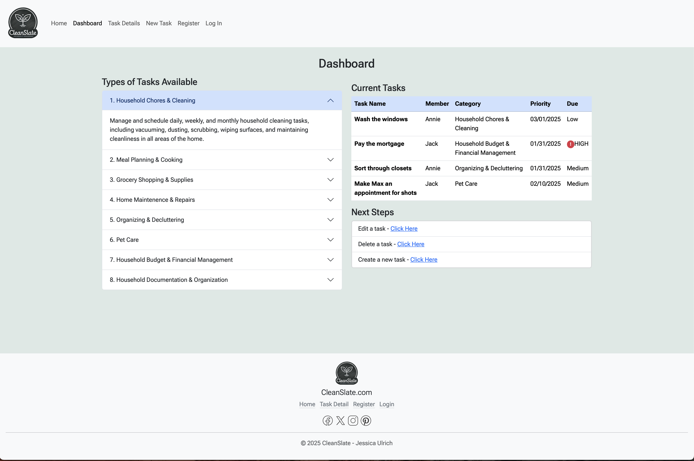
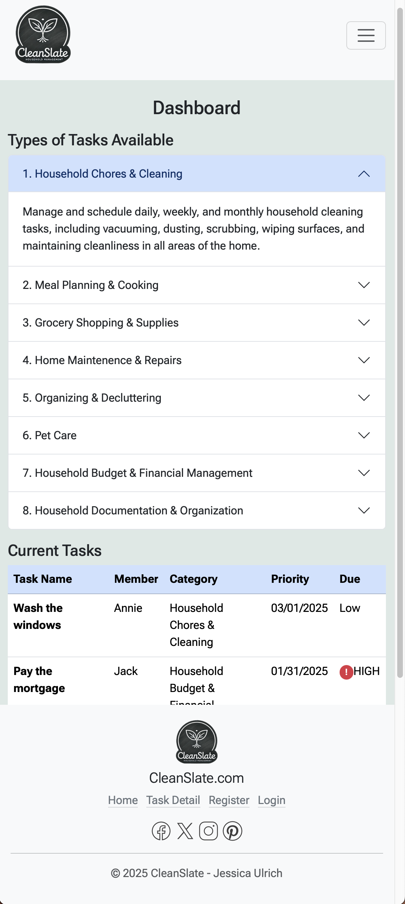

# Household Task Management Application

The Household Task Management Application builds upon my understanding of HTML5 and incorporates practice using Bootstrap 5 to create responsive webpages.  This mock home management application named CleanSlate, allows a user to create an account to manage all tasks related to their household. Elements utilized in this application are forms, cards, carousels, accordions, and badges.

## Installation

There is nothing to install to run this file; however, you will need to download all the associated files. Once downloaded, simply open the home.html file, and it will open in your default web browser. You will be able to follow the links on that page as long as the other files have downloaded as well.

## Necessary Files
1. home.html
2. dashboard.html
3. details.html
4. task_creation.html
5. register.html
6. login.html
7. static directory and all images inside

## Usage

Open the home.html file as seen below and click to follow the links.

- The Home/Landing Page showcases a carousel of clean home images and cards describing what the benefits of the CleanSlate application are.
- The Dashboard page displays an accordion with each of the task categories and a short description of that category.  It also shows a table of the tasks a user has created and when the deadlines are.  Finally, links to edit, delete, or create a new task are available.
- The Task Details page features cards with images and short bullet-point lists of the types of tasks that could fall within that category.
- The Register page features a short form to fill out to register for a CleanSlate account
- The Login Page allows registered users to login to their account.

## GitHub Link
[Module 9 Project - Task Management Application](https://github.com/jessicaanne0982/Module9_Project_Task_Management_App)